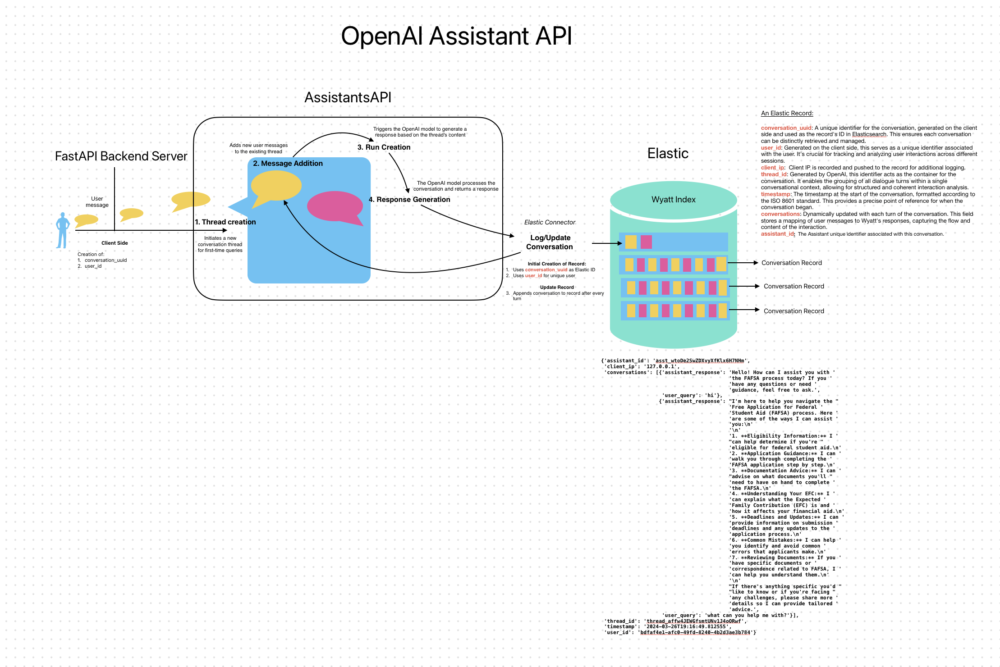

<div style="text-align: center; padding: 20px; background-color: #333;">
    <h1 style="font-family: 'Arial', sans-serif; color: #FFFFFF; font-size: 2.5em; margin: 20px 0;">Assistant-API</h1>
    <h2 style="font-family: 'Arial', sans-serif; color: #FFFFFF; font-size: 1.75em; margin-bottom: 20px; font-style: italic;">
        + Elasticsearch & Kibana
    </h2>
</div>


Welcome to the `assistant-api` package, which includes the AssistantsAPI backend designed to streamline inquiries through a chat widget. This application combines the capabilities of OpenAI's Assistants with Elasticsearch (for data storage), Kibana (for data visualization) to create an intuitive and efficient system for conversational storage, management, and visualization.

This infrastructure allows users to connect to an Assistant on OpenAI, interact with it, and store conversational data in an Elasticsearch index for future reference and analysis. With Kibana, users can visualize and explore the stored data. This combination ensures comprehensive observability and data-driven insights across all aspects of the application.

## Table of Contents
- [Diagram Depiction](#diagram-depiction)
- [Getting Started](#getting-started)
  - [Prerequisites](#prerequisites)
  - [Setting Up a Virtual Environment](#setting-up-a-virtual-environment)
  - [Configuration](#configuration)
  - [Running the Application](#running-the-application)
- [Startup](#startup)
  - [Running with Docker](#running-with-docker)
  - [Running without Docker](#running-without-docker)
- [Running from Docker Hub](#running-from-docker-hub)
- [Assistant API Overview](#assistant-api-overview)
- [Key Components](#key-components)
  - [FastAPI Setup](#fastapi-setup)
  - [OpenAI Integration](#openai-integration)
  - [Elasticsearch Connector](#elasticsearch-connector)
  - [Conversational Flow](#conversational-flow)
- [Running the Assistant](#running-the-assistant)
- [Environment Configuration](#environment-configuration)
- [Logging and Debugging](#logging-and-debugging)

<!-- The following Diagram depicts the flow of a user's message from end to end.
 -->

## Getting Started

### Prerequisites

- Python 3.11
- pip
- Poetry

### Setting Up a Virtual Environment

1. **Clone this repository:**
    ```bash
    git clone https://github.com/williamzebrowskI/assistant-api.git
    cd assistant-api
    ```

2. **Create a `.env` File**:
    Create a `.env` file in the root of your project and fill it with your OpenAI and Elasticsearch credentials:

    ```
    OPENAI_API_KEY=your_openai_api_key_here
    ASSISTANT_ID=your_assistants_id_here

    # Elasticsearch cloud authentication credentials
    ES_URL=https://localhost
    ES_PORT=9200
    ES_INDEX=ai-index
    ES_USERNAME=elastic
    
    CORS_ALLOWED_ORIGINS="http://127.0.0.1:8002"
    ```

    Ensure you replace the placeholder values with your actual credentials.

## Startup

### Running with Docker Compose

1. **Start the Docker Containers**:
    ```bash
    docker-compose up --build
    ```

2. **Accessing the Chat Interface:**
    Once the server is up and running, a link is provided in the logs directed to the chat widget, http://localhost:8001.

3. **Accessing Kibana:**
    Once Kibana is fully up and running, you can access it by navigating to [http://localhost:5601](http://localhost:5601) in your web browser. Kibana provides a powerful UI for visualizing and managing data in Elasticsearch. You can create dashboards, explore the data stored in your Elasticsearch indices, and set up alerts.

    To get into Kibana, the `username` and `password` will be printed after. ie:

    ```sh
    username: elastic
    password: <generated password>
    ```


### Running without Docker

1. **Clone the Repository**
    ```bash
    git clone https://github.com/williamzebrowskI/assistant-api.git
    cd assistant-api
    ```

2. **Create and Activate a Virtual Environment**
    ```bash
    python -m venv venv
    source venv/bin/activate  # On Windows use `venv\Scripts\activate`
    ```

3. **Install Dependencies**
    ```bash
    pip install poetry
    poetry install
    ```

4. **Set Up Environment Variables**
    Create a `.env` file in the root of your project and fill it with your OpenAI and Elasticsearch credentials:
    ```plaintext
    OPENAI_API_KEY=your_openai_api_key_here
    ASSISTANT_ID=your_assistants_id_here
    # Elasticsearch cloud authentication credentials
    ES_URL=your_elasticsearch_url_here
    ES_PORT=your_elasticsearch_port_here
    ES_INDEX=your_elasticsearch_index_name_here
    ES_API_KEY=your_elasticsearch_api_key_here
    CORS_ALLOWED_ORIGINS="http://127.0.0.1:8002"
    ELASTICSEARCH_ENABLED=false  # Set to true to enable Elasticsearch
    ```

5. **Run the Application**
    ```bash
    poetry run gunicorn --config ws/gunicorn_config.py --worker-class eventlet -w 1 app.main:app_instance -b 0.0.0.0:8002
    ```

### Running from Docker Hub

To make it easier for users to install and run the application, you can pull and run the Docker image directly from Docker Hub.

1. **Run the Docker Container**:

    ```bash
    docker run -d -p 8001:8001 -p 8002:8002 --name assistant-api --restart always \
        -e FE_PORT=8001 \
        -e ES_HOST=elasticsearch \
        -e ES_PORT=9200 \
        -e ES_INDEX=ai-index \
        -e ES_USERNAME=elastic \
        -e ES_PASSWORD_FILE=/app/es_config/es_output.txt \
        -e OPENAI_API_KEY=your_openai_api_key_here \
        -e ASSISTANT_ID=your_assistants_id_here \
        -v shared_data:/app/es_config \
        wzebrowski/assistant-api:<version number>
    ```

## Assistant API Overview

The Assistant API is designed to facilitate interactions with users seeking guidance or information via a ChatGPT-powered conversational interface. This assistant leverages the OpenAI API for generating responses and Elasticsearch for logging and retrieving conversation histories.

## Key Components

### FastAPI Setup

- **FastAPI Application**: Initiates a FastAPI server, enabling HTTP requests handling for the chat interface.
- **CORS Middleware**: Configures Cross-Origin Resource Sharing (CORS) settings to allow web requests from different origins, ensuring the frontend can communicate with the backend.

### OpenAI Assistant Integration

#### OpenAIAssistant Class Overview

The `OpenAIAssistant` class is designed to seamlessly integrate OpenAI's GPT models into our application, enabling the generation of dynamic, intelligent responses to user queries. This integration is pivotal for facilitating an engaging conversational experience in the Assistant API application.

##### Purpose

The primary purpose of the `OpenAIAssistant` class is to abstract the complexities involved in communicating with the OpenAI API. It manages the lifecycle of conversations, including initiating new threads, managing ongoing conversations, and generating responses based on user input.

##### Setup

To utilize the `OpenAIAssistant`, ensure you have the following configured:

- **API Key**: Securely store the OpenAI API key in your environment variables or `.env` file. This key is required to authenticate your requests to the OpenAI API.
- **Assistant Configuration**: Define the specific GPT model (e.g., `gpt-3.5-turbo`) and settings appropriate for your application's conversational needs.

##### Key Functionalities

###### `initialize_conversation()`

- Initializes a new conversation thread with OpenAI, setting up the context and parameters for the conversation.
- Stores conversation state to facilitate seamless continuation of the conversation.

###### `generate_response(user_query)`

- Sends the user's query to OpenAI and retrieves a response based on the current conversation context.
- Utilizes advanced natural language processing and generation techniques to ensure the response is relevant, accurate, and coherent.

###### `manage_conversation_state()`

- Dynamically manages the conversation's state, including tracking the conversation history and context changes.
- Ensures that each response is contextually appropriate, maintaining a natural and logical flow to the conversation.

#### Integration Benefits

Integrating the `OpenAIAssistant` class into our application brings several key benefits:

- **Enhanced User Experience**: By leveraging OpenAI's advanced NLP capabilities, the assistant can provide users with highly relevant, informative, and engaging responses.
- **Scalability**: The modular design of the `OpenAIAssistant` allows for easy updates and modifications, such as changing the GPT model or adjusting conversation parameters, without extensive code overhauls.
- **Simplicity**: The abstraction provided by the class simplifies the process of integrating complex AI functionalities into the application, making the development process more efficient and less error-prone.

##### Conclusion

The `OpenAIAssistant` class represents a core component of our Assistant API application, bridging the gap between user queries and the sophisticated language understanding and generation capabilities of OpenAI's GPT models. Through this integration, we aim to deliver an exceptional conversational experience that aids users in navigating their inquiries.

# Elasticsearch Connector

## Elastic Data Model Integration

This documentation outlines the setup and usage of the Elastic Data Model within our AssistantAPI application. Our model leverages Elasticsearch for operations such as document creation, updates, and management within an Elasticsearch index. The integration is facilitated through the `ElasticConnector` class, which establishes a connection to Elasticsearch using environmental variables and provides asynchronous methods for interacting with the data.

## Setup

### Environment Variables

Before utilizing the `ElasticConnector`, ensure the following environmental variables are set in your environment or within a `.env` file:

- `ES_URL`: The URL of your Elasticsearch instance.
- `ES_INDEX`: The Elasticsearch index to which documents will be pushed and from which they will be retrieved.
- `ES_PORT`: The port on which your Elasticsearch instance is running.

These variables are critical for establishing a connection to Elasticsearch. The connector will log warnings if any of these are unset.

## ElasticConnector Class

### Initialization

Upon instantiation, the `ElasticConnector` class initializes a connection to an Elasticsearch instance using the aforementioned environmental variables. This connection is essential for performing asynchronous operations against the Elasticsearch index.

### Methods

#### async push_to_index(conversation_uuid, user_id, thread_id, assistant_id)

This asynchronous method creates a new conversation document in Elasticsearch. The document includes metadata such as the user's ID, the client's IP address, the thread's ID, the assistant's ID, and a timestamp marking the creation time. This setup initializes an empty list for conversations to hold future interactions.

**Parameters:**

- `conversation_uuid` (str): Unique identifier for the conversation document.
- `user_id` (str): ID of the user initiating the conversation.
- `thread_id` (str): Unique identifier of the thread associated with the conversation.
- `assistant_id` (str): ID of the assistant involved in the conversation.

#### async update_document(conversation_uuid, user_query, assistant_response)

This method appends a new interaction to the conversations array of an existing document. Each interaction consists of a user query and the corresponding assistant response, allowing for the historical tracking of interactions within a conversation.

**Parameters:**

- `conversation_uuid` (str): Unique identifier for the conversation document.
- `user_query` (str): The query submitted by the user.
- `assistant_response` (str): The response generated by the assistant.

Both methods handle exceptions gracefully by logging errors, ensuring the application's stability in the face of Elasticsearch operation failures.

## Conclusion

The `ElasticConnector` class provides a streamlined approach to integrating Elasticsearch into your application for handling conversation data. By following the setup instructions and utilizing the provided methods, you can efficiently manage conversation documents within your chosen Elasticsearch index.

### Conversational Flow

1. **Client-Side Identification**: When the user starts a conversation, a `conversation_uuid` and `user_id` are generated to uniquely identify the session and user across interactions.
   
2. **Thread Creation**: Initiates a new conversation thread for first-time queries or appends messages to existing threads using the `thread_id`.
   
3. **Message Handling**: Manages the exchange of messages between the user and the OpenAI Assistant, maintaining the context and continuity of the conversation.
   
4. **Elasticsearch Logging**: Archives each conversation in Elasticsearch, tagging them with `conversation_uuid` and `user_id` to construct a detailed history for analysis and continued dialogue.

### Running the Assistant

- Execute `python app.py` to start the FastAPI server.
- Access the chat interface through the provided HTML frontend to interact with the assistant.

## Environment Configuration

Includes a `.env` file setup for securely managing API keys and Elasticsearch connection details, crucial for operational integrity and data security.

## Logging and Debugging

Utilizes Python's logging module to track application events, aiding in monitoring and troubleshooting.

---

This assistant exemplifies a modern approach to building conversational AI applications, emphasizing modularity, scalability, and ease of integration with advanced NLP models and database technologies.